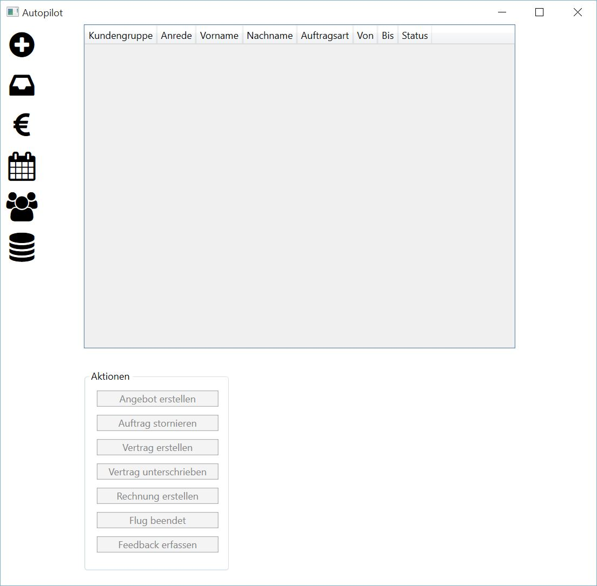

Aufträge
====================================================

Dieser Programmteil handelt die Abarbeitung eines Auftrages von der Angebotserstellung bis zur Rechnungslegung ab.

Im oberen Teil des Programmfensters werden alle Aufträge des Unternehmens tabellarisch dargestellt. Folgende Informationen werden ausgegeben:

::
	
	Kundengruppe
	Anrede
	Vorname
	Nachname
	Auftragsart
	Von
	Bis
	Status
	
.. note::
	Zur Sortierung der Tabelle einfach in den entsprechenden Spaltenkopf klicken.
	
Im unteren Bereich befindet sich eine Gruppe von Aktionen zur Auftragsabarbeitung.

.. note::
	Die Verfügbarkeit der einzelnen Aktion hängt vom derzeit selektierten Auftrag ab.

Um eine Aktion, z.B. die Angebotserstellung, durchzuführen, muss der jeweilige Auftrag per Mausklick in der Tabelle selektiert werden.

Angebot erstellen
----------------------------------------------------

Damit ein Angebot für einen Auftrag erstellt werden kann, müssen folgende Schritte abgearbeitet werden:

1. Selektion des Auftrages per Mausklick
2. Betätigung der Schaltfläche "Angebot erstellen"

.. note::
	Im Hintergrund wird automatisch ein Angebotsschreiben erstellt und dann zur Anzeige gebracht. Der Status "Aufnahme" des Auftrages ändert sich automatisch in "Angebot".
	
3. Weiterleitung des angezeigten Angebotsschreiben per Mail oder Post an den Kunden

Der Kunde hat nun die Möglichkeit das Angebot anzunehmen und einen Vertrag zu schließen oder den Auftrag zu stornieren.

Auftrag stornieren
----------------------------------------------------

Damit ein Angebot für einen Auftrag storniert werden kann, müssen folgende Schritte abgearbeitet werden:

.. note::
	Der Auftrag muss den Status "Angebot" oder "Vertrag" haben, um eine Stornierung vornehmen zu können.

.. warning::
	Der Vorgang des Stornierens kann nicht rückgängig gemacht werden.

1. Selektion des Auftrages per Mausklick
2. Betätigung der Schaltfläche "Angebot stornieren"
3. Erfassen des Ablehnungsgrundes

Anschließend ändert sich der Status "Angebot" bzw. "Vertrag" in "Storno".

Vertrag erstellen
----------------------------------------------------

Damit ein Vertrag für einen Angebot erstellt werden kann, müssen folgende Schritte abgearbeitet werden:

.. note::
	Der Auftrag muss den Status "Angebot" haben, um eine Vertragsversendung vornehmen zu können.

1. Selektion des Auftrages per Mausklick
2. Betätigung der Schaltfläche "Vertrag erstellen"

.. note::
	Im Hintergrund wird automatisch das Vertragsschreiben erstellt und dann zur Anzeige gebracht. Der Status "Angebot" des Auftrages ändert sich automatisch in "Vertrag".
	
3. Weiterleitung des angezeigten Vertragsschreiben per Mail oder Post an den Kunden

Der Kunde hat nun die Möglichkeit den Vertrag anzunehmen und diesen unterschrieben zurückzusenden oder den Auftrag zu stornieren.

Flugdurchführung
----------------------------------------------------

Damit ein Flug durchgeführt werden kann, muss der Kunde einen unterschriebenen Vertrag zurückgesendet haben. Um einen Flug zur Durchführung zu markieren, sind folgende Schritte notwendig:

.. note::
	Der Auftrag muss sich im Status "Vertrag" befinden.
	
1. Selektion des Auftrages per Mausklick
2. Betätigung der Schaltfläche "Vertrag unterschrieben"

.. note::
	Im Hintergrund wird automatisch der Status von "Vertrag" in "Durchführung" geändert.

Rechnung erstellen
----------------------------------------------------

Nach der Flugdurchführung kann eine Rechnung erzeugt werden, dazu müssen folgende Schritte abgearbeitet werden:

.. note::
	Der Auftrag muss den Status "Durchführung" haben, um eine Rechnungslegung vornehmen zu können.

1. Selektion des Auftrages per Mausklick
2. Betätigung der Schaltfläche "Rechnung erstellen"

.. note::
	Im Hintergrund wird automatisch das Rechnungsschreiben erstellt und dann zur Anzeige gebracht. Der Status "Durchführung" des Auftrages ändert sich automatisch in "erstellt".
	
3. Weiterleitung des angezeigten Rechnungsschreiben per Mail oder Post an den Kunden

Mit dem Rechnungsschreiben geht auch ein Feedbackbogen an den Kunden.

Feedback erfassen
----------------------------------------------------

Nachdem der Flug durchgeführt und eine Rechnunglegung erfolgt, kann die Erfassung des Feedbacks stattfinden. Dazu müssen folgende Schritte abgearbeitet werden:

.. note::
	Der Auftrag muss den Status "erstellt" haben, um eine Feedbackerfassung vornehmen zu können.

1. Selektion des Auftrages per Mausklick
2. Betätigung der Schaltfläche "Feedback erfassen"
