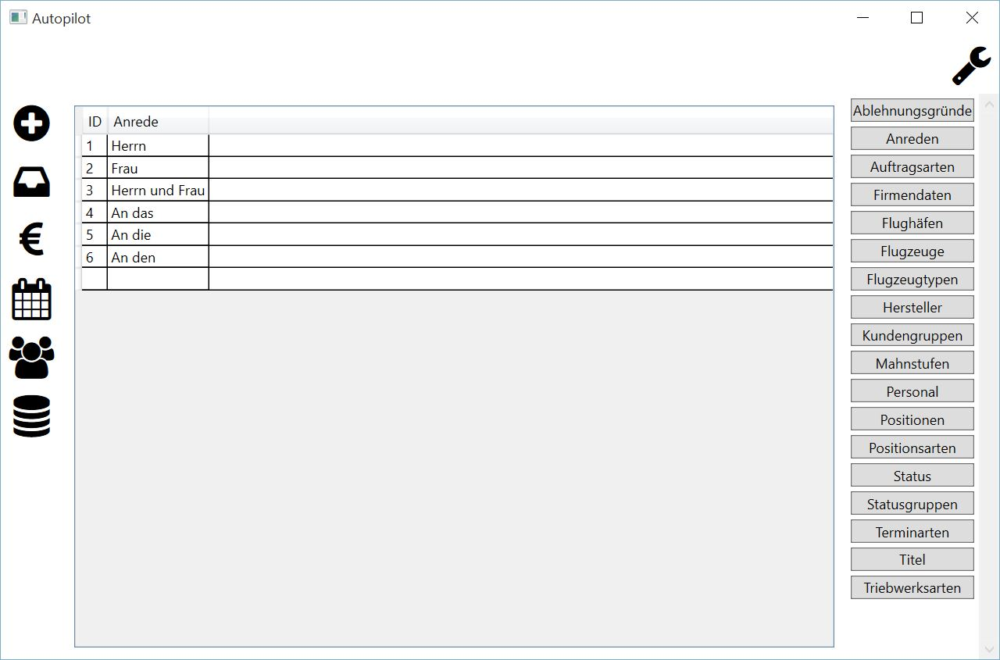

Einführung
====================================================

Systemanforderungen
----------------------------------------------------

**Betriebssystem:**

	- Microsoft Windows 7 oder höher
	- .NET Framework 4.5

**Hardware:**

	- Prozessor: 1 GHz oder schneller
	- RAM: 2 GB
	- freier Festplattenspeicher: 20 GB
	
**Software**
	
	- Acrobat Adobe Reader

Zusätzliche Standardperipheriegeräte wie Maus, Tastatur und Monitor werden vorausgesetzt.

Installation
----------------------------------------------------

Eine Installation der Anwendung ist nicht notwendig. Alle notwendigen Programmdateien werden durch den Softwarehersteller bereitgestellt.

.. note::
	Bitte beachten Sie die Softwareanforderungen!
	
Fehlende Verzeichnisse oder Dateien werden bei Bedarf durch die Anwendung automatisch erzeugt.

.. note::
	Der Benutzer der Anwendung muss zwingend Schreibrecht im Programmverzeichnis besitzen.
	
Starten
----------------------------------------------------

Die Anwendung wird durch einen Doppelklick auf die Datei "Autopilot.exe" oder dessen Verknüpfung darauf geöffnet.

Oberfläche
----------------------------------------------------

Die Oberfläche der Anwendung gliedert sich in drei wesentliche Bereiche:

::
	
	Links - Hauptnavigation - Neuer Auftrag, Aufträge, Rechnungen, Kalender, Kunden, Stammdaten
	Rechts - Unternavigation - in Abhängigkeit des gewählten Programmteils in der Hauptnavigation
	Mitte - Arbeitsbereich
	

	
	Stammdaten - Anrede

Sicherung
----------------------------------------------------

Zur Wiederherstellung eines Programmstandes ist es notwendig, das komplette Programmverzeichnis inklusive aller Unterverzeichnisse zu sichern.

Wiederherstellung
----------------------------------------------------

Zur Wiederherstellung eines Programmstandes ist es notwendig, die komplette Sicherung des Programmverzeichnis inklusive aller Unterverzeichnisse einzuspielen.

.. note::
	Das Programm muss dazu zwingend vorher beendet werden.
