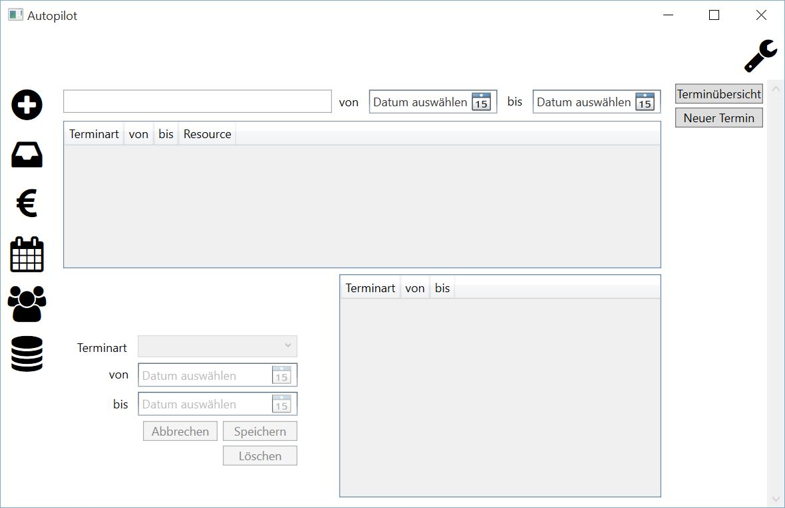

Terminübersicht
====================================================

Die Maske der Terminübersicht gliedert sich in vier Bereiche.

Suchfeld
----------------------------------------------------

Das Suchfeld befindet sich ganz oben und ist nach dem Starten der Anwendung leer. Bei einer Eingabe erfolgt eine sofortige Filterung der angezeigten Termine in der Übersicht. Es wird folgende Spalte durchsucht:

::
	
	Ressource
	

.. note::
	Eine Eingabe im Suchfeld hat eine sofortige Auswirkung auf die Anzahl der angezeigten Termine in der Übersicht.	

Zusätzlich kann eine Eingrenzung nach Beginn- und Endedatum erfolgen. Dazu muss in den beiden Auswahlboxen jeweils ein entsprechendes Datum gewählt werden.
	
Terminübersicht
----------------------------------------------------

Direkt unter dem Suchfeld werden die Termine tabellarisch dargestellt. Zur Anzeige werden gebracht:

::
	
	Terminart
	von
	bis
	Ressource
	
.. note::
	Die Anzahl der angezeigten Termine ist abhängig von den Eingaben im Suchfeld sowie den Datumseingaben. 
	
Damit alle Termine dargestellt werden, muss das Suchfeld geleert werden. Die Auswahl eines Termins erfolgt über den Mausklick. Danach können die Eigenschaften des gewählten Termins geändert werden.

Termin bearbeiten
----------------------------------------------------

.. warning::
	Änderungen können nicht rückgängig gemacht werden.

Nachdem in der Terminübersicht ein Termin per Mausklick ausgewählt wurde, können dessen Eigenschaften geändert werden. Folgende Schritte sind dazu notwendig:

1. Tabelleneintrag in der Terminübersicht per Mausklick selektieren
2. Das Ändern der Termineigenschaften ist nun möglich

::

	Terminart - einen Eintrag aus der Auswahlbox selektieren
	von
	bis

3. Die Änderung mit der Schaltfläche "Speichern" übernehmen
4. Die Sicherheitsabfrage beantworten

::
	
	Ja - Änderungen speichern
	Nein - Abbruch, keine Änderung
	
.. note::
	Termine der Art "Charter" können in der Teminübersicht nicht geändert werden.
	
Terminanzeige
----------------------------------------------------

In der Tabelle rechts neben dem Bereich zum Bearbeiten der einzelnen Termineigenschaften werden abhängig zur gewählten Ressource sowie Beginn- und Endedatum alle Termine angezeigt. Diese Übersicht dient der Information.

Termin löschen
----------------------------------------------------

.. warning::
	Änderungen können nicht rückgängig gemacht werden.

Nachdem in der Terminübersicht ein Termin per Mausklick ausgewählt wurde, kann dieser gelöscht werden. Folgende Schritte sind dazu notwendig:

1. Tabelleneintrag in der Terminübersicht per Mausklick selektieren
2. Das Löschen mit der Schaltfläche "Löschen" initiieren
4. Die Sicherheitsabfrage beantworten

::
	
	Ja - Termin wird gelöscht
	Nein - Abbruch, keine Löschung
	
.. note::
	Termine der Art "Charter" können in der Teminübersicht nicht gelöscht werden.