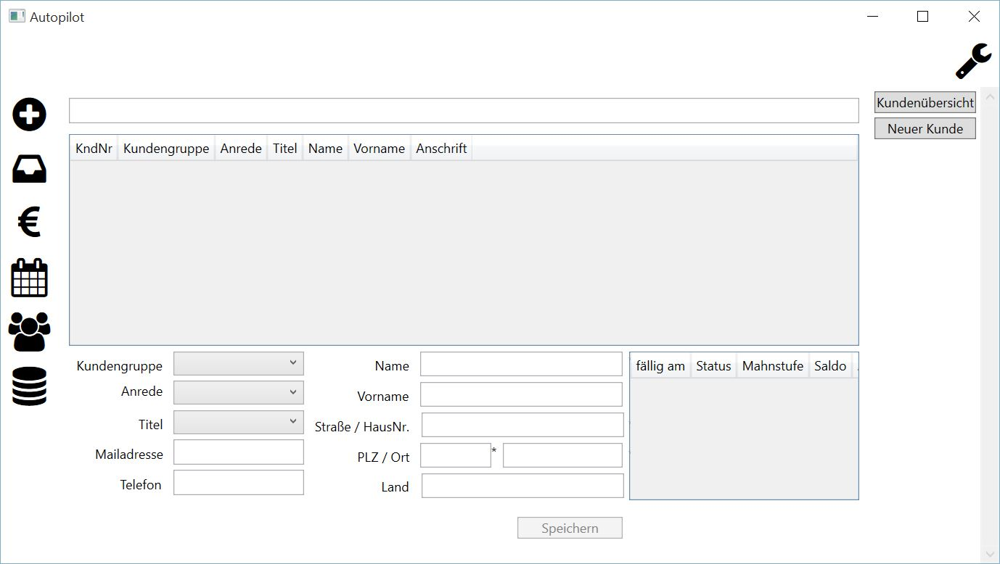

Kundenübersicht
====================================================

Die Maske der Kundenübersicht gliedert sich in vier Bereiche.

Suchfeld
----------------------------------------------------

Das Suchfeld befindet sich ganz oben und ist nach dem Starten der Anwendung leer. Bei einer Eingabe erfolgt eine sofortige Filterung der angezeigten Kunden in der Übersicht. Es werden folgende drei Spalten durchsucht:

::
	
	Name
	Vorname
	Anschrift
	

.. note::
	Eine Eingabe im Suchfeld hat eine sofortige Auswirkung auf die Anzahl der angezeigten Kunden in der Übersicht.	

Kundenübersicht
----------------------------------------------------

Direkt unter dem Suchfeld werden die Kunden tabellarisch dargestellt. Zur Anzeige werden gebracht:

::
	
	KndNr - Kundennummer, technischer Schlüssel
	Kundengruppe
	Anrede
	Titel
	Name
	Vorname
	Anschrift
	
.. note::
	Die Spalte "KndNr" bezeichnet einen technischen Schlüssel und kann daher nicht verändert werden. Die Einträge werden durch das System verwaltet.
	
Die Anzahl der angezeigten Kunden ist abhängig von den Eingaben im Suchfeld. Damit alle Kunden dargestellt werden, muss das Suchfeld geleert werden. Die Auswahl eines Kunden erfolgt über den Mausklick. Danach können die Eigenschaften des gewählten Kunden geändert werden.

Kundendaten bearbeiten
----------------------------------------------------

.. warning::
	Änderungen können nicht rückgängig gemacht werden.

Nachdem in der Kundenübersicht ein Kunde per Mausklick ausgewählt wurde, können dessen Eigenschaften geändert werden. Folgende Schritte sind dazu notwendig:

1. Tabelleneintrag in der Kundenübersicht per Mausklick selektieren
2. Das Ändern der Kundeneigenschaften ist nun möglich

::

	Kundengruppe - einen Eintrag aus der Auswahlbox selektieren
	Anrede - einen Eintrag aus der Auswahlbox selektieren
	Titel - einen Eintrag aus der Auswahlbox selektieren
	Name - Bearbeiten des Names
	Vorname - Bearbeiten des Vornamens
	Straße / Hausnummer  - Bearbeiten der Anschrift
	PLZ - Bearbeiten der PLZ
	Ort - Bearbeiten des Ortes
	Land - Bearbeiten des Landes
	Mailadresse - Bearbeiten der Mailadresse
	Telefon - Bearbeiten der Telefonnummer

3. Die Änderung mit der Schaltfläche "Speichern" übernehmen
4. Die Sicherheitsabfrage beantworten

::
	
	Ja - Änderungen speichern
	Nein - Abbruch, keine Änderung

	
Rechnungsanzeige
----------------------------------------------------

In der Tabelle rechts neben dem Bereich zum Bearbeiten der einzelnen Kundeneigenschaften werden zum gewählten Kunden alle Aufträge angezeigt. Diese Übersicht dient der Information.