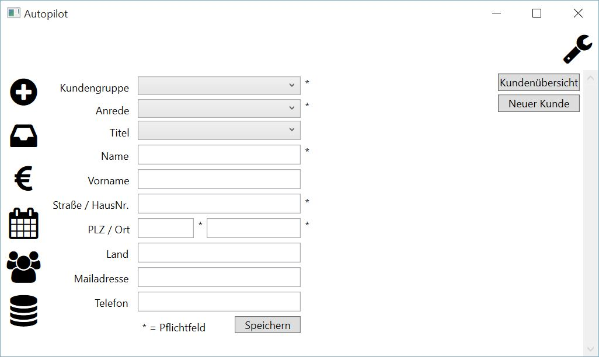

Neuer Kunde
====================================================

Diese Maske dient der Neuanlage eines Kunden. Folgende Schritte sind dazu notwendig:

1. Ausfüllen der Eigenschaftsfelder

::

	Kundengruppe - einen Eintrag aus der Auswahlbox selektieren
	Anrede - einen Eintrag aus der Auswahlbox selektieren
	Titel - einen Eintrag aus der Auswahlbox selektieren
	Name - Bearbeiten des Names
	Vorname - Bearbeiten des Vornamens
	Straße / Hausnummer  - Bearbeiten der Anschrift
	PLZ - Bearbeiten der PLZ
	Ort - Bearbeiten des Ortes
	Land - Bearbeiten des Landes
	Mailadresse - Bearbeiten der Mailadresse
	Telefon - Bearbeiten der Telefonnummer 

2. Die Schaltfläche "Speichern" anklicken
3. Die Sicherheitsabfrage beantworten

::
	
	Ja - Neuen Kunden anlegen
	Nein - Abbruch, keinen neuen Kunden anlegen
	
3. Die Hinweismeldung mit "OK" beantworten. (erscheint nur nach den Zufügen)
	
.. note::
	Die Felder "Kundengruppe", "Anrede", "Name", "Straße / HausNr.", "PLZ" und "Ort" stellen Pflichtfelder dar und müssen gefüllt sein.

