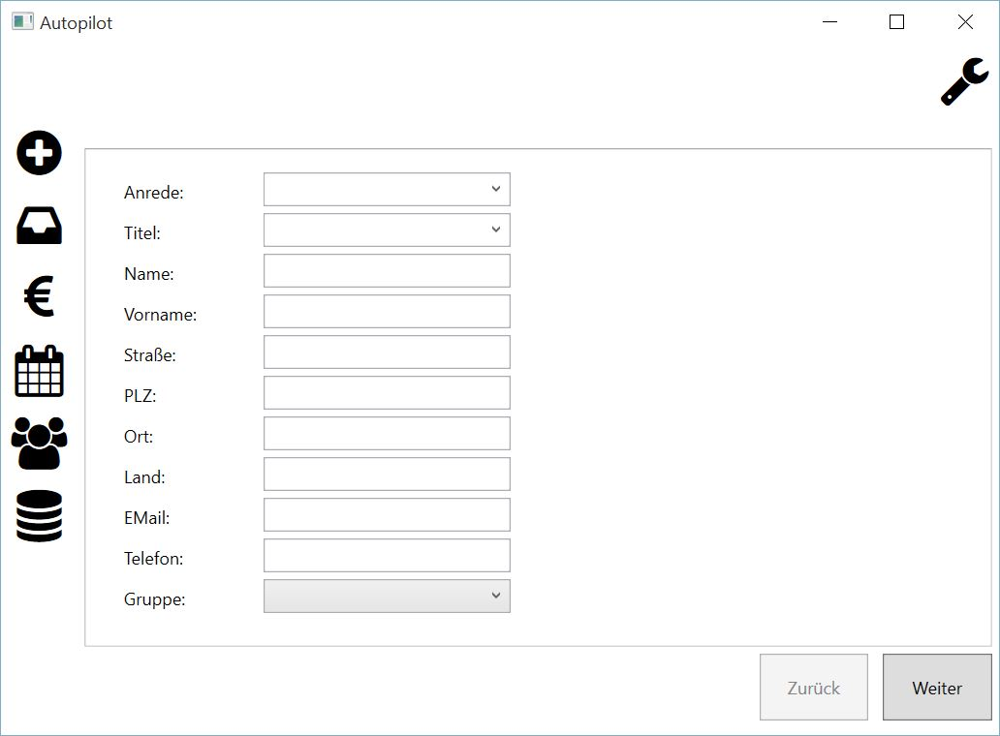
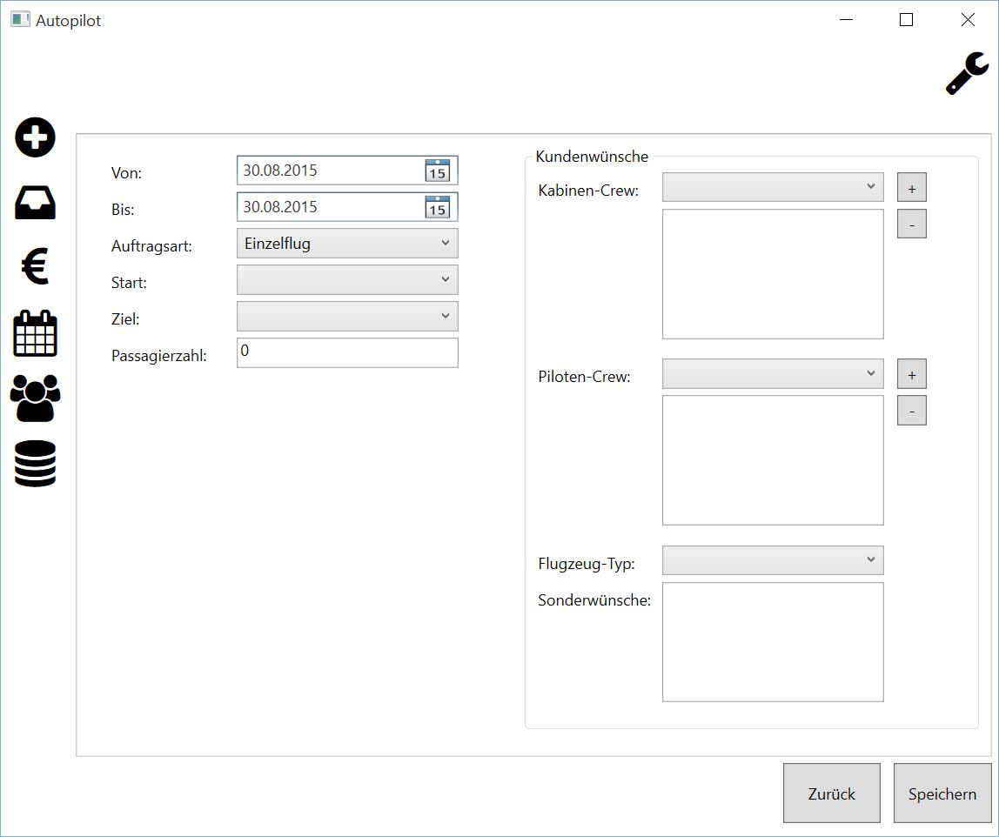
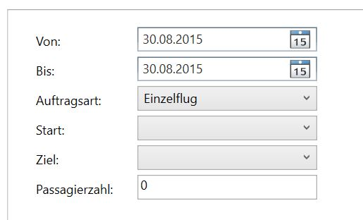
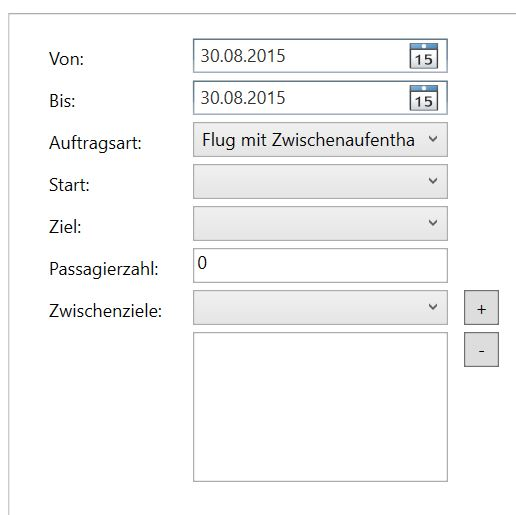
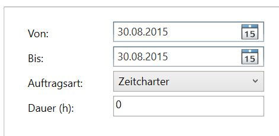

Neuer Auftrag
====================================================

Dieser Programmteil dient zur Anlage eines neuen Auftrages.

Kundendaten
----------------------------------------------------

Begonnen wird mit der Aufnahme der Kundendaten:

::
	
	Anrede - einen Eintrag aus der Auswahlbox selektieren
	Titel - einen Eintrag aus der Auswahlbox selektieren
	Name
	Vorname
	Straße - incl. Hausnummer
	PLZ - Postleitzahl
	Ort
	Land
	EMail
	Telefon
	Kundengruppe - VIP/CORP/PRE
	
Nach dem Erfassen der Kundendaten ist ein Mausklick auf die Schaltfläche "Weiter" notwendig, um in die Aufnahme der Auftragdetails zu wechseln.

Flugdetails
----------------------------------------------------

Zur Erfassung des Zeitraumes, einfach das entsprechende Datum auswählen:

::
	
	Von
	Bis
	
Für die Auftragsart gibt es drei Möglichkeiten:

::
	
	Einzelflug
	Flug mit Zwischenlandung
	Zeitcharter
	
Für den **Einzelflug** sind folgende Angaben notwendig:

::
	
	Start - einen Eintrag aus der Auswahlbox selektieren
	Ziel - einen Eintrag aus der Auswahlbox selektieren
	Passagieranzahl
	

.. note::
	Derzeit ist die Auswahl eines Start-/Zielflughafens noch sehr benutzerunfreundlich. Wir arbeiten mit Hochdruck an einer Programmverbesserung, in der wir diesen Umstand abstellen.
	
Für den **Flug mit Zwischenlandung** sind folgende Angaben notwendig:

::
	
	Start - einen Eintrag aus der Auswahlbox selektieren
	Ziel - einen Eintrag aus der Auswahlbox selektieren
	Passagieranzahl
	Zwischenziele - einen Eintrag aus der Auswahlbox selektieren
	

Damit eine Zwischenlandung zu einem Auftrag hinzugefügt wird, sind folgende Arbeitsschritte notwendig:

1. Einen Flughafen aus der Auswahlbox "Zwischenziele" wählen
2. Über die Schaltfläche "+" wird der Flughafen dem Auftrag zugefügt und in der darunter liegenden Tabelle angezeigt.

Damit eine Zwischenlandung aus einem Auftrag entfernt wird, sind folgende Arbeitsschritte notwendig:

1. Den zu löschenden Flughafen aus der Tabelle mit den Zwischenlandungen per Mausklick markieren.
2. Die Schaltfläche "-" per Mausklick betätigen, um den Flughafen zu entfernen.

Für die Auftragsart **Zeitcharter** sind folgende Angaben notwendig:

::
	
	Dauer (h) - Zeit der Charter in Stunden
	

Auf der rechten Seite der Auftragdetails ist die Aufnahme folgender Punkte möglich:

::
	
	Kabinencrew - einen Eintrag aus der Auswahlbox selektieren
	Flightcrew - einen Eintrag aus der Auswahlbox selektieren
	Flugzeugtyp - einen Eintrag aus der Auswahlbox selektieren
	Sonderwünsche
	
Damit eine **Kabinencrew** zu einem Auftrag hinzugefügt wird, sind folgende Arbeitsschritte notwendig:

1. Einen Mitarbeiter aus der Auswahlbox "Kabinencrew" wählen
2. Über die Schaltfläche "+" wird der Mitarbeiter dem Auftrag zugefügt und in der darunter liegenden Tabelle angezeigt.

Damit eine Kabinencrew aus einem Auftrag entfernt wird, sind folgende Arbeitsschritte notwendig:

1. Den zu löschenden Mitarbeiter in der Tabelle "Kabinencrew" per Mausklick markieren.
2. Die Schaltfläche "-" per Mausklick betätigen, um den Mitarbeiter zu entfernen.

Damit eine **Flightcrew** zu einem Auftrag hinzugefügt wird, sind folgende Arbeitsschritte notwendig:

1. Einen Mitarbeiter aus der Auswahlbox "Flightcrew" wählen
2. Über die Schaltfläche "+" wird der Mitarbeiter dem Auftrag zugefügt und in der darunter liegenden Tabelle angezeigt.

Damit eine Flightcrew aus einem Auftrag entfernt wird, sind folgende Arbeitsschritte notwendig:

1. Den zu löschenden Mitarbeiter in der Tabelle "Flightcrew" per Mausklick markieren.
2. Die Schaltfläche "-" per Mausklick betätigen, um den Mitarbeiter zu entfernen.

Zur Auswahl eines **Flugzeugtyps** ist lediglich die Selektion eines Typs in der Auswahlbox notwendig.

Die Erfassung von zusätzlichen **Sonderwünschen** erfolgt über eine seperate Textbox. Hier kann Freitext eingetragen werden.

Zur endgültige Speicherung des Auftrages ist das Betätigen der Schaltfläche "Speichern" notwendig.

.. note::
	Das Speichern erfolgt ohne eine weitere Sicherheitsabfrage.
	