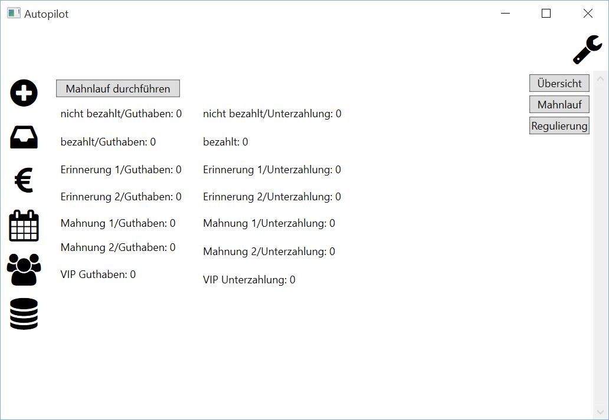

Mahnlauf
====================================================

Über den Programmpunkt "Mahnlauf" können für fällige Rechnungen Mahnstufen gesetzt und Mahnzuschläge erzeugt werden.

Um einen Mahnlauf durchzuführen, ist lediglich ein Mausklick auf die Schaltfläche "Mahnlauf durchführen" und das Beantworten der Sicherheitsabfrage mit "Ja" nötig.

.. note::
	Bei einem Mahnlauf werden nur fällige Rechnungen berücksichtigt.
	Während der Durchführung des Mahnlaufes ist das Weiterarbeiten in der Applikation nicht möglich.

Ist der Mahnlauf beendet, erscheint ein entsprechender Hinweistext.
