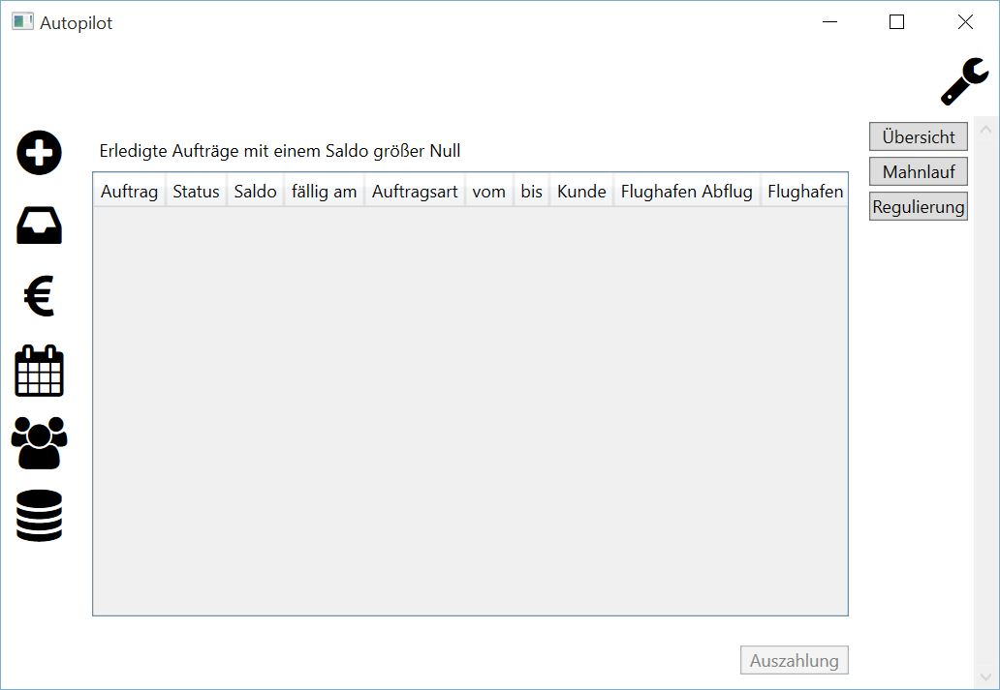

Regulierung
====================================================

In diesem Programmteil werden Rechnungen angezeigt, deren Status "bezahlt" und Saldo größer 0 Euro ist.

Zur Anzeige werden hier gebracht:

::
	
	Auftrag - Auftragsnummer, technischer Schlüssel
	Status
	Saldo
	fällig am - Datum der Fälligkeit
	Auftragsart
	vom - Beginn des Auftrages
	bis - Ende des Auftrages
	Kunde - Name des Kunden
	Flughafen Abflug
	Flughafen Ziel
	
Damit eine Auszahlung an den Kunden direkt durchgeführt werden kann, sind folgende Schritte notwendig:

.. warning::
	Buchungen können nicht rückgängig gemacht werden.

1. Auswahl der Rechnung per Mausklick
2. Betätigung der Schaltfläche "Auszahlung"
3. Beantwortung der Sicherheitsabfrage

::
	
	Ja - Buchung der Auszahlung
	Nein - Abbruch, keine Buchung

Folgende wurde durch die Applikation im Hintergrund durchgeführt:

1. Setzen des Status der Rechnung auf "bezahlt" 
2. Zufügen einer Buchung mit Tagesdatum