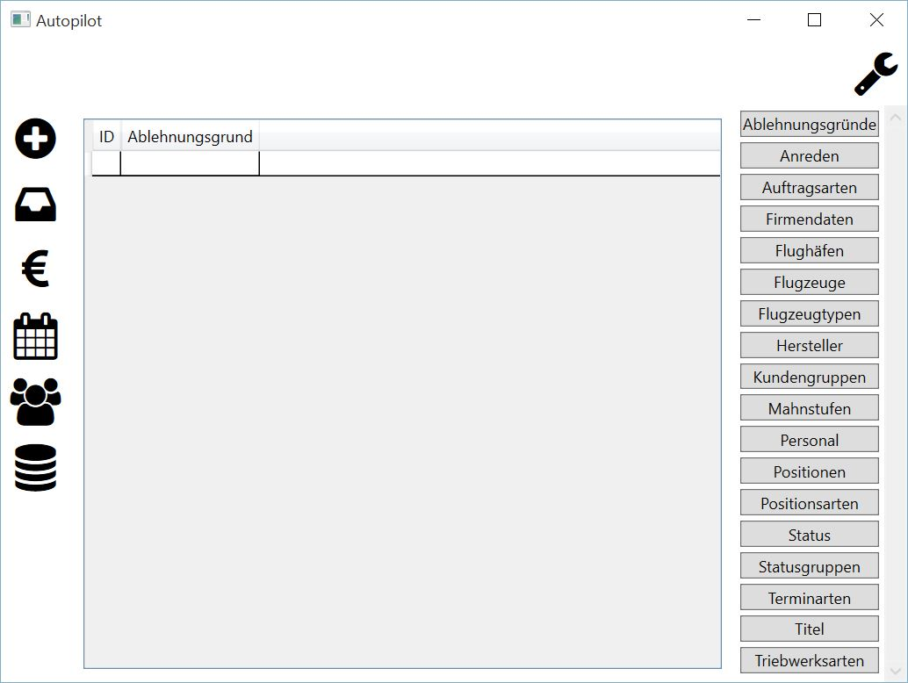

Ablehnungsgründe
====================================================

Diese Tabelle dient zur Pflege von Ablehnungsgründen. Zur Anzeige werden gebracht:

::

	ID - technischer Schlüssel
	Ablehnungsgrund - Bezeichnung des Grundes
	
.. note::
	Die Spalte "ID" bezeichnet einen technischen Schlüssel und kann daher nicht verändert werden. Die Einträge werden durch das System verwaltet.
	
Zufügen
----------------------------------------------------

.. warning::
	Das Zufügen einer Zeile sollte mit Bedacht erfolgen, da das Entfernen einer Zeile über die normale Programmoberfläche nicht möglich ist.

Um die Tabelle mit einem neuen Eintrag zu erweitern, sind folgende Schritte notwendig:

1. Zur untersten Zeile scrollen (leere Zeile)
2. In die Spalte "Ablehnungsgrund" klicken, sodass ein Cursor erscheint
3. Den Ablehnungsgrund eintippen
4. Die Eingabe mit der Taste <<ENTER>> beenden
5. Die Sicherheitsabfrage beantworten

::
	
	Ja - Neue Zeile einfügen
	Nein - Abbruch, Zeile wird nicht zugefügt
	
6. Die Hinweismeldung mit "OK" beantworten. (erscheint nur nach den Zufügen)

Die neue Zeile erscheint nun in der Tabelle.

Bearbeiten
----------------------------------------------------

.. warning::
	Änderugen an Datensätzen werden sofort durchgeführt. 
	Es erfolgt keine Sicherheitsabfrage. 
	Änderungen können nicht rückgängig gemacht werden.

Um einen Tabelleneintrag zu bearbeiten, sind folgende Schritte notwendig:

1. Tabelleneintrag per Mausklick selektieren
2. Durch das Drücken der Taste <<F2>> wird der Bearbeiten-Modus aktiviert
3. Das Ändern des Eintrages ist nun möglich
4. Die Änderung mit der Taste <<ENTER>> beenden 

Löschen
----------------------------------------------------

Das Löschen von Zeilen ist nicht möglich.