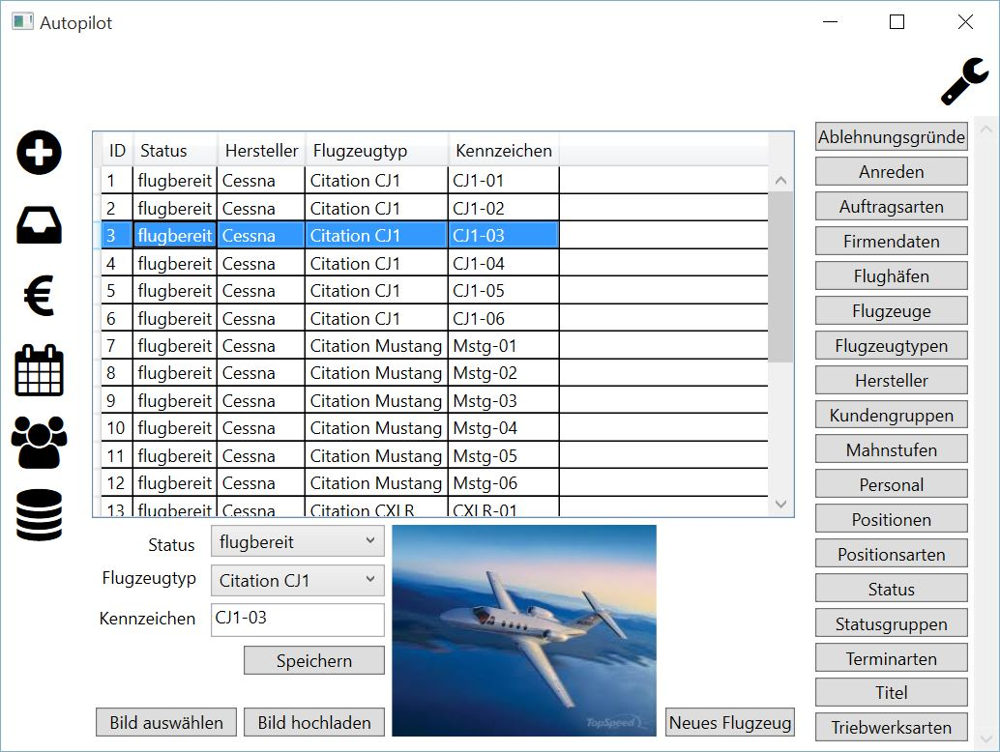

Flugzeuge
====================================================

Diese Tabelle dient zur Pflege Ihrer Flugzeuge. Zur Anzeige werden gebracht:

::

	ID - technischer Schlüssel
	Status
	Hersteller
	Flugzeugtyp
	Kennzeichen
	
.. note::
	Die Spalte "ID" bezeichnet einen technischen Schlüssel und kann daher nicht verändert werden. Die Einträge werden durch das System verwaltet.
	
Zufügen
----------------------------------------------------

.. warning::
	Das Zufügen einer Zeile sollte mit Bedacht erfolgen, da das Entfernen einer Zeile über die normale Programmoberfläche nicht möglich ist.

Um die Tabelle mit einem neuen Eintrag zu erweitern, sind folgende Schritte notwendig:

1. Die Schaltfläche "Neues Flugzeug" anklicken
2. Die Sicherheitsabfrage beantworten

::
	
	Ja - Neues Flugzeug anlegen
	Nein - Abbruch, kein neues Flugzeug anlegen
	
3. Die Hinweismeldung mit "OK" beantworten. (erscheint nur nach den Zufügen)

.. note::	
	Ein neues Flugzeug mit dem Kennzeichen "<<Dummy>>" wurde angelegt und muss nun bearbeitet werden.

Bearbeiten
----------------------------------------------------

.. warning::
	Änderungen können nicht rückgängig gemacht werden.

Um einen Tabelleneintrag zu bearbeiten, sind folgende Schritte notwendig:

1. Tabelleneintrag per Mausklick selektieren
2. Das Ändern der Flugzeugeigenschaft ist nun möglich

::

	Status - einen Eintrag aus der Auswahlbox selektieren
	Flugzeugtyp  - einen Eintrag aus der Auswahlbox selektieren
	Kennzeichen - Bearbeiten des Kennzeichens
	
3. Die Änderung mit der Schaltfläche "Speichern" übernehmen
4. Die Sicherheitsabfrage beantworten

::
	
	Ja - Änderungen speichern
	Nein - Abbruch, keine Änderung
	
Flugzeugbild
----------------------------------------------------

Wird ein Flugzeug durch einen Mausklick in der Tablle selektiert, so wird zusätzlich ein Bild des Flugzeuges (sofern vorhanden) zur Anzeige gebracht.

Zur Speicherung eines Flugzeugbildes sind folgende Schritte notwendig:

1. Auswahl eines Flugzeuges per Mausklick
2. Öffnen der Dateiauswahl durch einen Mausklick auf die Schaltfläche "Bild auswählen"
3. Auswahl einer Datei
4. Dateiauswahl abschließen

::	
	
	Öffnen - Auswahl der gewählten Datei
	Abbrechen - Abbruch ohne Auswahl
	
5. Anzeige des gewählten Bildes (nur bei vorheriger Auswahl "Öffnen")
6. Speichern des Bildes über die Schaltfläche "Bild hochladen"

.. note::
	Beim Speichern von Bildern ist zu beachten, dass es derzeit keine Dateigrößenlimitierung gibt. Das Speichern von übergroßen Dateien kann zu Performanceeinbußen bei der Datenbankgeschwindigkeit führen.

Löschen
----------------------------------------------------

Das Löschen von Zeilen ist nicht möglich.